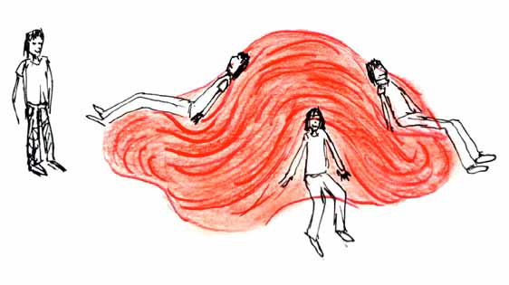
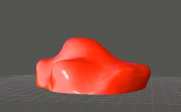
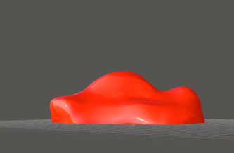
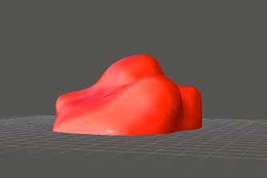
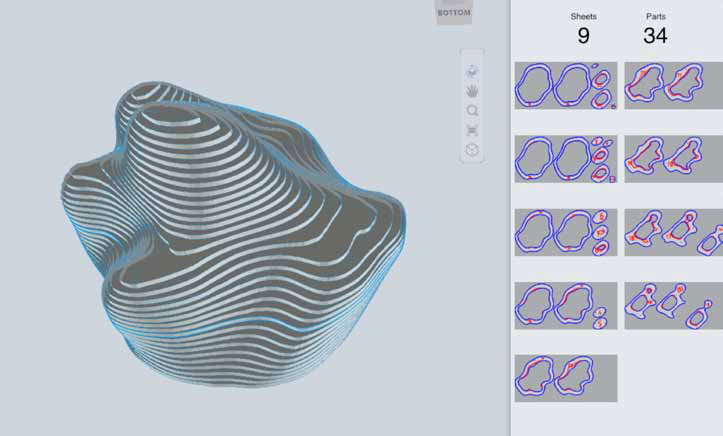
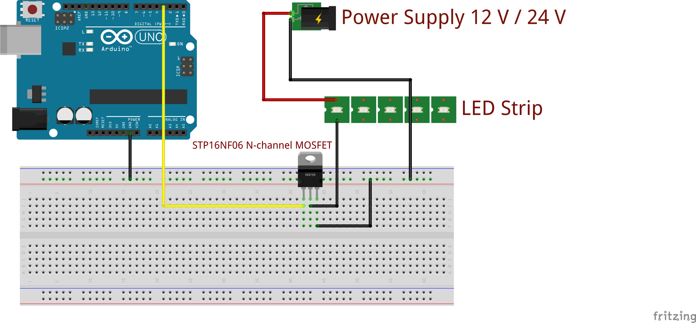
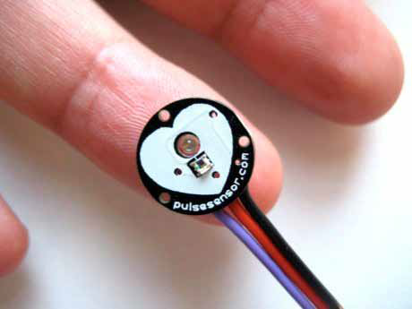
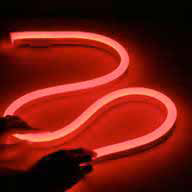
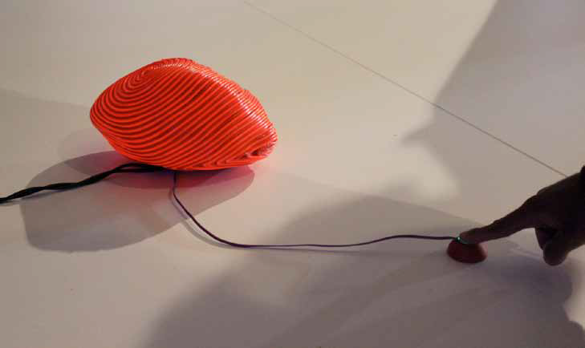

Heart Of The City
==================================================================

The Heart of the city is an interactive public art sculpture that pulses light according to the heartbeat
of the people. The sculpture invites several people to sit and interactive with it.
When a person places its finger on the pulse sensor located in one of the seats of the sculpture,
it starts light on and off according with the rhythm of the heart beat of the user. When nobody is
touching the pulse sensor, the Heart of the City has its own rhythm and illumination.
The piece aims to bring closer the heartbeat of the citizens by creating a heart to the city where
people could hang out and experience an expansion of their own heart shared with others.

AUTHOR
--------------------------------------
- Anaisa Franco <http://www.anaisafranco.com>
- Aravinth Panchadcharam <http://aravinth.info>
- Annie McKinnon <http://anniemckinnon.tumblr.com>

DESIGN
--------------------------------------
### CONCEPT OF MODEL

The shape of the sculpture comes from an original human heart model that I
modified to get the desired shape for the project.
The sculpture will fit several people at the same time.
It will have only one pulse sensor located in one of the seats that will pulse the
light of the entire sculpture on and off. It can only be activated by one person at
a time.
The sculpture surface will be 10 m2.
The structure will be robust, waterproof, durable and its shape will be adapted
and can be scaled according to the space around it.

<table>
<td></td>
<td></td>
</tr>
<tr>
<td></td>
<td></td>
</tr>
</table>

### INTERNAL STRUCTURE

The interior structure will be made of mdf wood pieces shaped with laser cutting.
The inside will be empty to store the electronics and the micro-controler.
The wooden shape is covered with LED Neon flex to create a skin-feel touch.

### CIRCUIT DIAGRAM

### PULSE SENSOR

The pulse sensor will be place on the sculpture. People need to sit on the sculpture
and place their finger on the sensor. Suddenly it will light on and off following
the participant’s heartbeat.

### LED NEON FLEX

### PROTOTYPE

